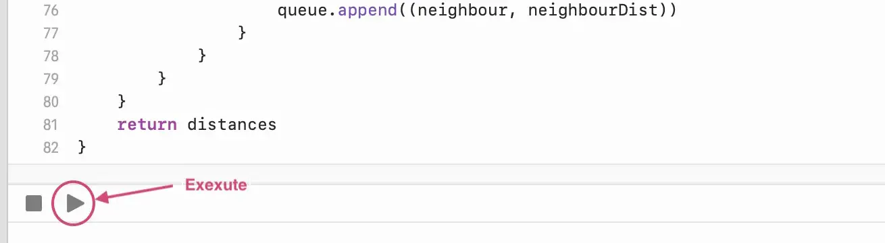
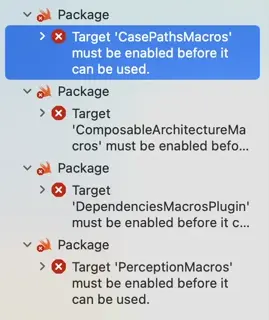

# Answers to Moovup's Mobile Developer Programming Test
## Prerequisite
- Xcode 15.4
## Question 1
The solutions for questions 1a and 1b can be found within the `Question 1.playground` file. 

The response to question 1a is implemented in the `getAllPossiblePaths()` function, while the answer to question 1b is provided by the `getLeastNumberOfHops()` function. To view the results, simply execute the playground.

## Question 2
Open `Question 2/Question 2.xcodeproj` and build the project with Xcode.

> [!TIP]
> When using the plugin for the first time, be sure to trust and enable
> it when prompted. If a macros build warning exists, select it to trust
> and enable the macros as well.

> [!TIP]
> When encounters build errors like `Target 'XXX' must be enabled before it can be used.`, click on the error and click `Trust & Enable` button in the popup to enable the selected macro.
